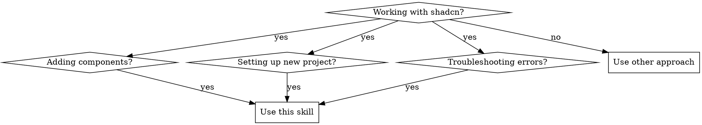

# Using shadcn

## Overview

shadcn is NOT a component library - it's a copy-paste collection. You own the code. Components are added via CLI and live in `src/components/ui/`.

**Core principle:** Always verify the full stack before adding components.

## When to Use



**Use when:**
- Adding shadcn components to a project
- Setting up shadcn in a new project
- Troubleshooting shadcn-related errors
- Getting errors about missing `cn` utility, missing CSS variables, or class variants

**Variants:** shadcn/ui (React), shadcn-vue (Vue), shadcn-svelte (Svelte)

## Quick Reference

| Task | Command | Check |
|------|---------|-------|
| Initial setup | `npx shadcn@latest init` | Creates components.json |
| Add component | `npx shadcn@latest add button` | Checks deps, creates file |
| Add multiple | `npx shadcn@latest add button card input` | Batch install |
| Vue variant | `npx shadcn-vue@latest add button` | Use shadcn-vue |
| Svelte variant | `npx shadcn-svelte@latest add button` | Use shadcn-svelte |

## Pre-Install Verification (REQUIRED)

**Before adding ANY component, verify:**

1. **Variant Detection (REQUIRED)**
   - Check `components.json` schema URL:
     - `shadcn-vue.com` → Use `shadcn-vue`
     - `shadcn.com` → Use `shadcn` (React)
     - `shadcn-svelte.com` → Use `shadcn-svelte`
   - Wrong variant = wrong CLI = failed install

2. **components.json exists**
   - Run: `cat components.json`
   - If missing: run `npx shadcn@latest init` first

3. **Required dependencies installed**
   ```bash
   # Check these are in package.json:
   - class-variance-authority (CVA)
   - clsx
   - tailwind-merge
   - tailwindcss-animate (for animations)
   ```

4. **Tailwind configuration**
   - `tailwind.config.js` has `content: ["./src/**/*.{ts,tsx}"]`
   - CSS variables defined in main CSS file

5. **Utility function exists**
   - `src/lib/utils.ts` contains `cn()` function
   - If missing: create it
   ```ts
   import { clsx, type ClassValue } from "clsx"
   import { twMerge } from "tailwind-merge"

   export function cn(...inputs: ClassValue[]) {
     return twMerge(clsx(inputs))
   }
   ```

## Component Availability

**Not all components exist in all variants:**
- React shadcn/ui has: radio, tabs, collapsible, etc.
- shadcn-vue may have different names or missing components
- Check registry before promising components to user

**When component doesn't exist:**
- CLI will error: "Component not found in registry"
- Don't promise without checking first

## Installation Pattern

```bash
# 1. Verify setup (REQUIRED)
cat components.json
ls src/lib/utils.ts

# 2. Add component(s)
npx shadcn@latest add button card dialog

# 3. Verify files created
ls src/components/ui/button.tsx
ls src/components/ui/card.tsx

# 4. Test import in your code
import { Button } from "@/components/ui/button"
```

## Common Mistakes

| Mistake | Symptom | Fix |
|---------|---------|-----|
| Missing `cn` utility | `cn is not defined` | Create `src/lib/utils.ts` |
| Wrong import path | Module not found | Use `@/components/ui/...` |
| Missing CVA | Class variants broken | Install `class-variance-authority` |
| Missing CSS variables | Styles not applying | Add to main CSS file |
| Skipping init | CLI not working | Run `npx shadcn@latest init` |

## Troubleshooting

**"Cannot find module '@/components/ui/..."**
- Check tsconfig.json has path alias: `"@": ["./src/*"]`
- Verify component file exists in `src/components/ui/`

**"className merging doesn't work"**
- Verify `tailwind-merge` is installed
- Check `cn()` utility exists in `src/lib/utils.ts`

**"Animations not working"**
- Install `tailwindcss-animate`
- Add to `tailwind.config.js` plugins

**"Component not found after install"**
- Check `components.json` `tsx` flag matches your project
- Verify `tailwind.config.js` content paths include component directory

**CLI fails with cryptic errors (ENOENT, empty string paths)**
- May be framework incompatibility (WXT, Nuxt, Astro)
- Try manual installation: copy component files from shadcn GitHub
- Check framework-specific shadcn documentation

## When CLI Fails

If the shadcn CLI doesn't work despite correct setup:

1. **Manual installation fallback**
   ```bash
   # Copy component source directly from shadcn repository
   curl -o src/components/ui/accordion.tsx \
     https://raw.githubusercontent.com/shadcn-ui/ui/main/apps/www/registry/new-york/ui/accordion.tsx
   ```

2. **Check framework compatibility**
   - WXT: May need manual component installation
   - Nuxt: Use `shadcn-nuxt` instead of `shadcn-vue`
   - Astro: Use `shadcn-astro` or manual installation

3. **Verify all prerequisites again**
   - Sometimes the error message is misleading
   - Re-check: components.json, dependencies, paths

## Red Flags - STOP and Verify

- "components.json exists, setup must be correct" → Verify ALL dependencies
- "There are already components, so CLI will work" → Check each requirement
- "If something breaks, user will tell me" → Verify BEFORE adding components
- "I'll just create the component file manually" → Use CLI, it checks deps
- "This is just adding a component" → Verify full stack first
- "User asked for multiple components at once" → Install individually, track each result
- "I'll batch install to save time" → Batch installs hide individual failures

**All of these mean: Stop. Verify setup completely before proceeding.**

## When User Says "Quickly" or "In a Hurry"

**STOP.** This is when mistakes happen. Rushed installs = broken setup = longer debugging.

```
☐ Verify all dependencies (30 seconds)
☐ Check variant (Vue vs React vs Svelte) (10 seconds)
☐ Check component availability in registry (10 seconds)
☐ Install components ONE AT A TIME (prevents cascade failures)
☐ Verify each install succeeded (5 seconds each)
☐ Report what's missing vs what was added (transparent communication)

Total time: ~2 minutes
Time saved debugging broken install: 15-30 minutes
```

**Batch install warning:**
- DO NOT batch install (e.g., `shadcn add button card input`)
- Each component may fail differently
- One failed component doesn't stop others from installing
- Under pressure, you're more likely to miss errors in batch output

## Rationalization Blockers

| Excuse | Reality |
|--------|---------|
| "components.json exists, so setup is done" | Missing deps cause runtime errors |
| "Other components work, so this will too" | Each component may need different deps |
| "I'll fix errors if they appear" | Prevention > debugging broken setup |
| "CLI is just copying files" | CLI validates and configures dependencies |
| "User just asked to add, not verify" | Broken component = failed request |
| "This is a simple task" | Simple tasks break without verification |
| "I can see the directory exists" | Directory ≠ working installation |
| "User said 'quickly', so I should skip verification" | Rushed installs take longer to debug |
| "I'll batch install to save time" | Batch installs hide individual failures |
| "All variants have the same components" | React/Vue/Svelte have different component sets |
| "The CLI will tell me if something is wrong" | Verify before, not after, errors occur |
